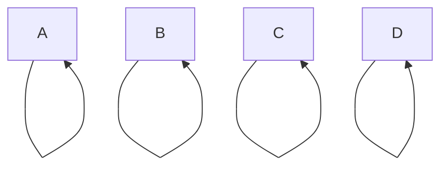
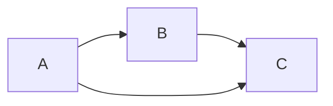

# Semantic Entailment

# Island of liers and truth speakers

# Forms

## CNF
## CNF Algorithm

## DNF

# DPLL procedure

# Sets

# Relations
- **Reflexive**: Every element is also related to itself

- **Transitive**: Whenever there is a relation $a \rightarrow b$ and $b \rightarrow c$, then R also relates $a \rightarrow c$

- **Symmetric**:
- **Anti-symmetric**: There is ==not a single mutual relationship== between any node

# Ordering Relations

****
