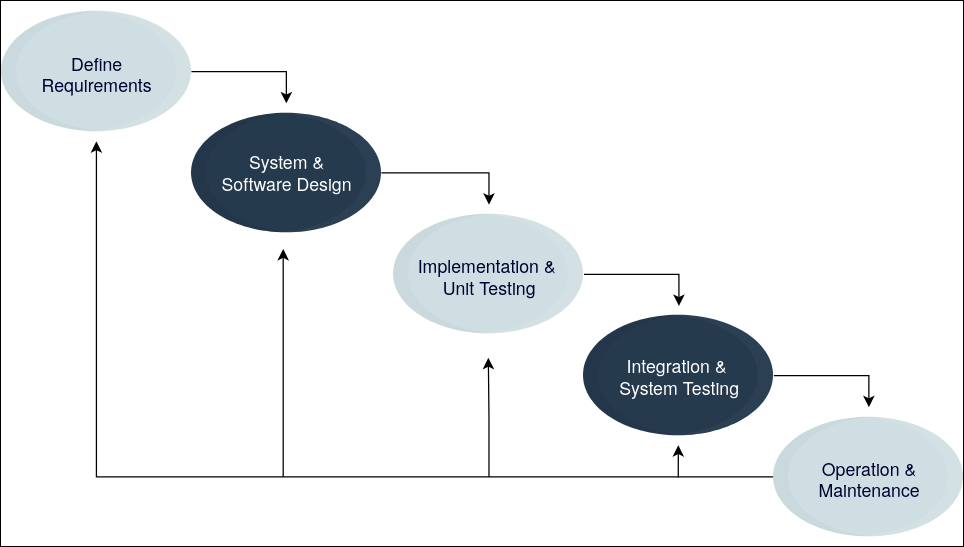

# Sofware Engineering Processes Definition
An Engineering Discipline that concerns all aspects of ==software production==, from early stages to maintenance
- Concerned with **professional** software development.

# Activities
- Software Specification
- Software development
- Software validation
- Software evolution

**Examples**:
- Development of tools and frameworks to support SD
- Management of SD
- Specification of steps, rules and processes for SD

# Importance
Lot's of people rely on software systems, 
- Usually it's cheaper to use SE methods, rather than starting to code straight away.
- We can also assure a higher software quality

# Issues of Software
**Heterogeneity**: Systems have different types, mobile, computers..
**Change** in Business ans social elements: they change quickly, and software needs to adapt.
**Security/Trust/Privacy**: More connected to personal lives, and manages sensitive elements.

# Software Engineering Fundamentals
- Software should be developed using a development **process**, that is appropiate for the situation.
- Dependability (availability, reliability, maintainability) and performance
- Managing Software Specification and Requirements
- Reuse software when appropiate

# SEP : Definition
A structured set of Activities required to develop a software system
(Common activities include: ==Specification, Design, Implementation, Test/Validation, Maintenance and Evolution==)

## Software Process Model
An abstract representation of a process 
- The Description of a process from a particular perspective

### Software Process Descriptions
- Activities: Steps are defined by the Model
- Products: Outcomes of a process activity
- Roles: Responsibilities of the people involved
- Pre/Post-conditions: statements that must hold before or after an activity is happening

### Types of Software Process Models
- In practice a combination of both **Plan-driven** and **Agile** elements are used
- There is no right or wrong Software Process Model
#### Plan-driven
- All processes/activities are **planned** in advance
- Progress is measured against the **plan**
#### Agile
- Planning is **incremental** and **easier to change** the process to adapt to requirements.
### Specific Software Process Models
**Definition**: An abstraction of the software development process. It shows the order of activities and in which sequence they are performed.
In practice, large systems us a process that includes activities from multiple different models.

#### Waterfall
The typical **Plan driven** process Model 
- Sequential activities
- Separate and distinct activities
- Each activity has to finish, before the next one can start
##### Phases

###### 1. Analysis: Requirements and Specification
- Establish the required functionality and constrainst on the software operation and development.

- **Requirements Engineering process**
    - Feasablity Study: Is it technically and financially feasible to build the system?
    - Requirements elicitation: What do the stakeholders require/expect from the software?
    - Requirements Specification: Defining the requirements in detail.
    - Requirements validation: Checking the validity of the requirements.
###### 2. Design: solution proposal and Description
- Design a solution meeting the requirements
- Translate the requirements specificaiton into a solution
- Design a software to meet the specification
`Drawing and modelling what the implemented system should look like, what tech to use, how to connect it and structure it?`
###### 3. Implementation
- Translate the design into an executable program
> [!IMPORTANT]
> The activities of Design and Implementation are closely related and may be **interleaved** 
###### 4. Integration, Testing and Deployment 
- **Verification** and **Validation** (V & V): The software conforms to it's specification and meets the requirements of the customer.
- **Testing**: Executing the system test cases
    - Most Commonly used in V & V
###### 5. Maintenance and Evolution
- Solve bugs and other problems
- Improve the existent functionality
- Extend the software with additional functionality

##### Advantages and Limitations
**Advantages**
- Applied where requirements are stable
- Useful for work coordination in large projects where the development is done at several sites
- Easy to follow the Progress

**Limitations**
- Does not cope with changes in requirements
- Not flexible
#### Incremental development
Objective: Cope with changes
- Develop the system in increments
    - Evaluate each increment before proceeding to the next.
- Normal approach in agile methods
- Activities are interleaved
- Evaluation done by user/customer proxy
- Plan-driven or Agile
> [!IMPORTANT]
> It's like like multiple mini waterfall models

- Requirements are **prioritized**
    - First higher priority requirements then lower
    - During each increment **requirements are frozen** (To be able to complete the increments)
- Other requirements can evolve

##### Incremental Delivery
- Each increment delivers customer value
- Functionality is available earlier
- Earlyer increments are seen as prototypes, and help elicit later more requirements
- **Lower risk of overall project failure**
- More testing for higher priority functionality

##### Limitations
- The process is not visible
- The structure/architecture tends to degrade by adding new increments
- Most systems require basic facilities used by different Functionality
- The essence is that **the specification is developed with the software**

#### Bohem's Spiral Model
- Represented as a spiral where each loop represents a phase 
- Phases are chosen depending on the requirements 
- Importance to Risk assessement in the model 

#### Spiral Sectors
- Objective setting: Identify specific objectives for this phase
- Risk assessmnet and reduction
- Development and validation: Development model for the system is chosen 
- Planning: Project review for the next phase, and repeat 
#### Spiral Model Usage
- Introduced **iteration** in software processes 
- Introduced **risk-driven** approach to development 
- **Rarely used in practice**

#### Reuse oriented 
- Software is assembled from existing components
- Plan-driven or Agile
- Systematic reuse of available software 
- Process steps:
    1. Component analysis 
    2. Requirements modification/adaptation 
    3. System design and reuse
    4. Development and Integration
- Reuse is the **standard approach for many types of business systems**
- Examples:
    - Web services
    - Collections of objects as a package to be integrated with a component framework (eg. .NET)
    - Stand-alone software systems: configured to be used in a particular environment

#### Rapid Application Development RAD 
**Objective**: Produce useful software quickly (based on prototyping)
**Main idea**: Software developed in **increments**, where each increment provides new functionality
- Emerged as an alternative to Waterfall in 1980/1990's 

##### Characteristics
- Specification, design and implementation are **interleaved** 
- Software is developed as a series of **versions** with **stakeholders involved** in version evaluation 
- UI's are developed in an IDE and graphical toolset

#### Agile Software Development 
- Reduce overhead in software process (eg. less documentation)
- **Respond quickly** to changing requirements without excessive rework
- Guidelines
    - Focus code > design 
    - Iterative approach in SD 
    - Deliver working software quickly
> [!IMPORTANT] Agile Manifesto
> We are uncovering better ways of developing software by doing it and helping others do it.
> Through this work we have come to value:
> - Individuals and interactions over processes and tools
> - Working software over comprehensive documentation
> - Customer collaboration over contract negotiation
> -  Responding to change over following a plan
>
> That is, while there is value in the items on the right, we value the items on the left more.

